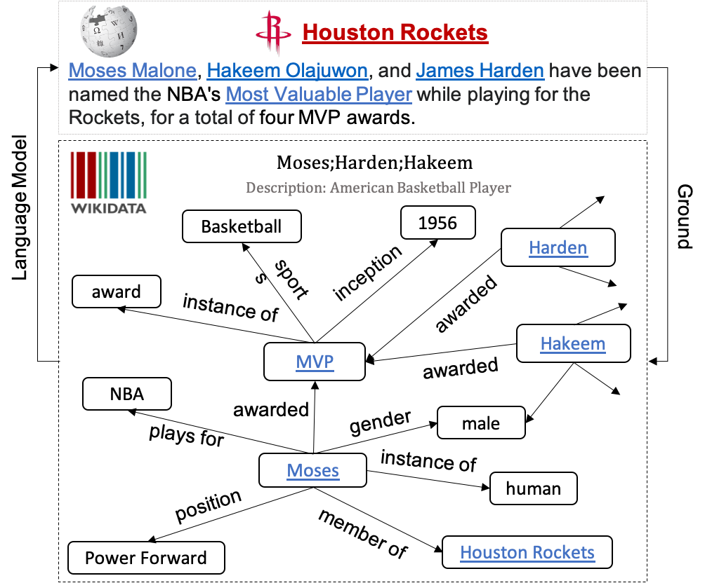
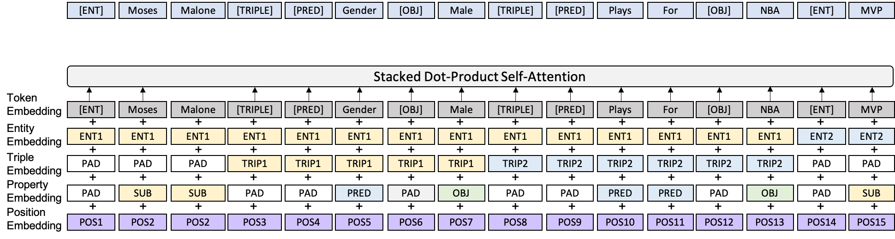
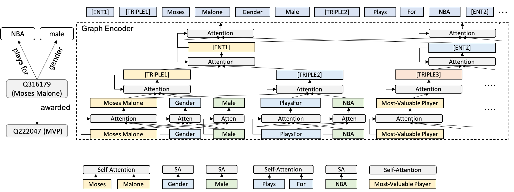

# KGPT: Knowledge-Grounded Pre-Training
Code and Data for EMNLP2020 Paper [KGPT: Knowledge-Grounded Pre-Training for Data-to-Text Generation](https://arxiv.org/abs/2010.02307), this paper proposes a distanly-supervised pre-trainning algorithm to train general data-to-text architectures: 1) sequence KGPT and 2) Graph KGPT. Both of the two models can be applied to a wide range of data-to-text generation tasks. We crawl 7 million distanly-supervised data-to-text data from Wikipedia to pre-train this generation and finetune it on the downstream tasks. The finetuned model can achieve SOTA on multiple datasets and the improvements under few-shot setting are especially dramatic.

<p align="center">

</p>

Sequence Encoder:
<p align="center">

</p>

Graph Encoder:
<p align="center">

</p>

## Requirements:
- [huggingface transformer 2.6.0](https://github.com/huggingface/transformers)
- [pytorch 1.4.0](https://pytorch.org/)
- tensorboardX
- tqdm

## Download Preprocessed Dataset
```
wget https://kgpt.s3-us-west-2.amazonaws.com/dataset.zip
unzip dataset.zip
```
If you want to do pre-training, pleaase download the WikiData Graph as well
```
wget https://kgpt.s3-us-west-2.amazonaws.com/preprocess.zip
unzip preprocess.zip
```

## Download Pre-trained KGPT model
```
wget https://kgpt.s3-us-west-2.amazonaws.com/models.zip
unzip models.zip
```

## Option1: Finetune on Full Set
Finetune the model on the full downstream dataset
### Sequence Encoder
  - WebNLG
    ```
      bash scripts/webnlg/finetune_sequence_webnlg_from_wikidata.sh 0 checkpoint_wikidata/checkpoint_sequence_head8_layer6_GPT2_maxfact12/model_ep14.pt
    ```
  - E2ENLG
    ```
      bash scripts/e2enlg/finetune_sequence_e2enlg_from_wikidata.sh 0 checkpoint_wikidata/checkpoint_sequence_head8_layer6_GPT2_maxfact12/model_ep14.pt
    ```
### Graph Encoder
  - WebNLG
    ```
      bash scripts/webnlg/finetune_graph_e2enlg_from_wikidata.sh 0 checkpoint_wikidata/checkpoint_sequence_head8_layer6_GPT2_maxfact12/model_ep14.pt
    ```
  - E2ENLG
    ```
      bash scripts/e2enlg/finetune_graph_e2enlg_from_wikidata.sh 0 checkpoint_wikidata/checkpoint_graph_head8_layer6_GPT2_maxfact12/model_ep14.pt
    ```

## Option2: Finetune for Few-Shot Leanring
Finetune the model on the 1% downstream dataset
- WebNLG
  ```
    scripts/webnlg/finetune_sequence_webnlg_from_wikidata_fewshot.sh 0 checkpoint_wikidata/checkpoint_sequence_head8_layer6_GPT2_maxfact12/model_ep14.pt 0.01
  ```
- E2ENLG
  ```
    bash scripts/e2enlg/finetune_sequence_e2enlg_from_wikidata.sh 0 checkpoint_wikidata/checkpoint_sequence_head8_layer6_GPT2_maxfact12/model_ep14.pt 0.01
  ```
  
## Model selection
Evaluate all the saved models on the validation set to select the best model.
### Sequence Encoder
  ```
    bash scripts/webnlg/eval_sequence_webnlg_all.sh 0 test checkpoint_webnlg/checkpoint_finetune_sequence_head8_layer6_GPT2_maxfact12/
  ```
### Graph Encoder
  ```
    bash scripts/webnlg/eval_graph_webnlg_all.sh 0 test checkpoint_webnlg/checkpoint_finetune_graph_head8_layer6_GPT2_maxfact12/
  ```

## Final test
For example, the model at 20th epoch arrives the best score, then you will output prediction using the following command.
### Sequence Encoder
  ```
    bash scripts/webnlg/eval_sequence_webnlg.sh 0 challenge checkpoint_webnlg/checkpoint_finetune_sequence_head8_layer6_GPT2_maxfact12/model_ep20.pt
  ```
### Graph Encoder
  ```
    bash scripts/webnlg/eval_graph_webnlg.sh 0 challenge checkpoint_webnlg/checkpoint_finetune_graph_head8_layer6_GPT2_maxfact12/model_ep20.pt
  ```

## Evaluation
We use the standard e2e evaluation pipeline
```
  https://github.com/wenhuchen/Data-to-text-Evaluation-Metric.git
  cd Data-to-text-Evaluation-Metric
  ./measure_scores.py ../dataset/webnlg/test.txt ../checkpoint_webnlg/checkpoint_finetune_graph_head8_layer6_GPT2_maxfact12/model_ep20.txt
```

## Reproducing our results
We have released our fine-tuned models in [Google Drive](https://drive.google.com/file/d/1ABl4By9oxU8eFo212jXJ2b2gem8Y2a02/view?usp=sharing).
You can simply type in the following command to generate the decoded text file, which replicates the reported score in the paper.
```
bash scripts/webnlg/eval_sequence_webnlg.sh 0 test checkpoint_webnlg/checkpoint_finetune_sequence_head8_layer6_GPT2_maxfact12_from_ep14/model_ep30.pt
```


## Pre-training
If you want to pre-train the model by yourself, please prepare as many GPUs as you can. Our project uses 8 TITAN RTX GPUs (24G memory) and pre-train on the KGText with batch size of 128 for roughly 10 days. The pre-training can be easily started with the following command:
```
  bash scripts/wikidata/train_sequence_wikidata_pretraining.sh 0,1,2,3,4,5,6,7
```
The best performance is normally achieved during 8-14th epoch, the model uses the default setting of 6 layers with 8 heads.

## Citation
If you find this project useful, please cite it using the following format
```
  @article{chen2020kgpt,
  title={KGPT: Knowledge-Grounded Pre-Training for Data-to-Text Generation},
  author={Chen, Wenhu and Su, Yu and Yan, Xifeng and Wang, William},
  journal={Proceedings of EMNLP 2020},
  year={2020}
}
```

## Q\&A
If you have any questions about the paper and the github, please feel free to leave an issue or send me an email.
